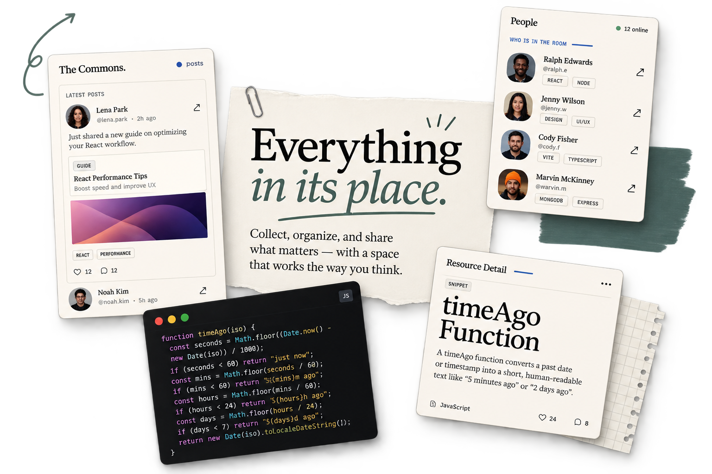

# Aside — Client

React frontend for **Aside**, a cohort knowledge library.

**Live app:** https://aside-client.vercel.app
**Backend repo:** https://github.com/aliihsaad/aside-server

> The API is on Render's free tier — the first request after idle takes ~40 seconds.



---

## What it is

A cohort keeps two kinds of knowledge: the conversation, and the artifacts. **The
Commons** is the feed. **The Library** is what's worth keeping. A resource belongs to
a person first, sits on their shelf, and anyone can fork it into their own — with the
lineage preserved.

---

## Stack

React 19 · Vite 8 · React Router 7 · axios · lucide-react · plain CSS with custom properties

No UI framework and no CSS library. The whole design system is custom properties in
`src/index.css`.

---

## Local setup

```bash
git clone https://github.com/aliihsaad/aside-client.git
cd aside-client && npm install
cp .env.example .env      # then point VITE_API_URL at your API
npm run dev
```

## Environment

| Variable | Purpose |
|---|---|
| `VITE_API_URL` | Base URL of the API, including `/api` |

Vite only exposes variables prefixed `VITE_`, and anything in one is **public** in the
built bundle. Nothing secret goes here.

---

## Routes

| Path | Page | Auth |
|---|---|---|
| `/signup` · `/login` | Register / sign in | – |
| `/library` | The shared library, with filters | ✔ |
| `/feed` | The Commons — posts, comments, mentions | ✔ |
| `/people` | Cohort directory | ✔ |
| `/saved` | Bookmarked resources | ✔ |
| `/profile/:userId` | A profile and its folders | ✔ |
| `/profile/edit` | Edit your own profile | ✔ |
| `/posts/:postId` | A post and its thread | ✔ |
| `/resources/new` | Create a resource | ✔ |
| `/resources/:id` | Resource detail — code, links, comments, fork, save | ✔ |
| `/resources/:id/edit` | Edit a resource | ✔ |
| `/resources/:id/lineage` | Where a resource came from, and what came from it | ✔ |
| `/folders/:folderId` | One shelf | ✔ |

Everything except signup and login sits behind `ProtectedRoute` with an `<Outlet />`.

---

## Structure

| Path | What's in it |
|---|---|
| `src/context/` | `AuthContext` (the object) and `AuthProvider` (state + actions) |
| `src/lib/` | axios instance, `useAuthContext`, `useFetch`, upload helpers |
| `src/components/` | Reusable UI — cards, modal, sidebar, comment list, buttons |
| `src/pages/` | One file per route, each with its own CSS file |

Context, provider and hook are **three separate files** because Vite's Fast Refresh
only works when a file exports components exclusively. Putting the hook next to the
provider breaks hot reload in a way that looks like a state bug.

---

## Notable decisions

- **Auth actions live in the provider.** Components call `login(body)`, never
  `api.post("/auth/login")` directly, so token handling exists in exactly one file.
- **`loading` starts `true`.** On refresh there's a window where a token exists but
  hasn't been verified yet. Starting at `false` makes `ProtectedRoute` redirect a
  logged-in user to the login page for a fraction of a second on every reload.
- **One `CommentList` component** serves both comment endpoints, taking `endpoint`,
  `parentField` and `parentId` as props — because the server has two comment models.
- **Optimistic updates only for saving.** `SaveButton` flips immediately and rolls
  back if the request fails, because a save is cheap and reversible. Everything else
  waits for the server; a delete isn't worth guessing about.
- **Uploads go through the API, not straight to Cloudinary.** The browser never holds
  the Cloudinary credentials.
- **Third-party text is rendered as text.** Uploaded filenames and pasted URLs are
  never inserted as HTML, links are `https:` only and carry `rel="noopener noreferrer"`.

---

## Known limitations

- Search fires on every keystroke. Fine at cohort scale, but it wants debouncing before
  it sees real volume.
- Search matches whole stemmed words rather than substrings, because the API uses a
  MongoDB text index — "auth" won't find "authentication".
- The lineage view expands one level at a time and stops at three levels deep, because
  recursing the whole tree server-side is an unbounded query.
- No optimistic UI for comments — each one waits for the round trip, which is visible
  on a cold API.
- Images and documents are capped at 5 MB by the API.
